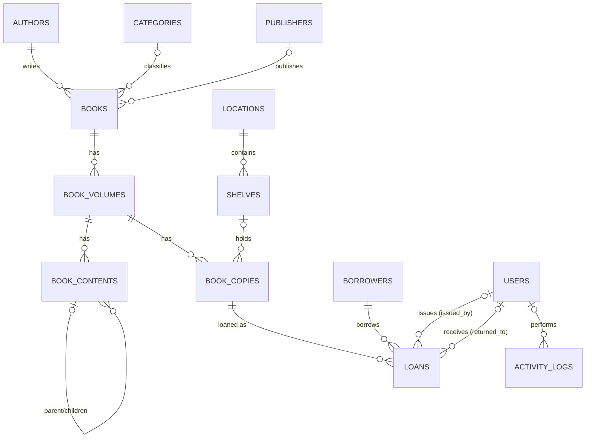

# Database — madrasah_library

This document describes the real Postgres schema backing the app. All Django
models in `library/models.py` are declared with `managed = False` — Django
never creates or alters these tables. The schema below is the source of
truth; `models.py` is a read/write mapping onto it, not the other way around.

## Setup

1. Copy `.env.example` to `.env` and fill in real values (DB password,
   `SECRET_KEY`, etc.). `.env` is git-ignored — never commit it.
2. Install dependencies: `pip install -r requirements.txt`
3. `python manage.py check` to confirm settings load correctly.

Django reads `SECRET_KEY`, `DEBUG`, `ALLOWED_HOSTS`, and all `DB_*` values
from the environment via `python-decouple` (see `config/settings.py`).
`database.py` (the standalone psycopg helper used by the `test_*.py` scripts
at the project root) reads the same `DB_*` variables.

## Entity-relationship overview



(`||--o{` = required one-to-many, `|o--o{` = optional/nullable one-to-many.)

## Tables

| Table | Purpose | Key columns |
|---|---|---|
| `authors` | Book authors | `name` (unique) |
| `categories` | Book categories | `name` (unique) |
| `publishers` | Book publishers | `name` (unique), `city` |
| `books` | Titles | `title`, `author_id` (required), `category_id`/`publisher_id` (optional) |
| `book_volumes` | Physical/logical volumes of a book | `book_id`, `volume_number` (unique per book), `title` |
| `book_contents` | Table-of-contents entries per volume, self-nesting via `parent_id` | `volume_id`, `parent_id`, `title`, `content_type`, `page_number`, `sort_order` |
| `locations` | Physical library areas | `name` (unique) |
| `shelves` | Shelves within a location | `location_id`, `shelf_code` (unique per location) |
| `book_copies` | Physical copies of a volume | `volume_id`, `shelf_id` (optional), `copy_code` (unique), `status` |
| `borrowers` | People who can borrow books | `name`, `phone`, `borrower_type`, `registration_no` (unique when set), `is_active` |
| `users` | Staff/librarian accounts (not wired to Django auth — see note below) | `username` (unique), `role`, `is_active` |
| `loans` | Issue/return records | `copy_id`, `borrower_id`, `issue_date`, `due_date`, `return_date`, `issued_by`, `returned_to` |
| `activity_logs` | Audit trail of CREATE/UPDATE/DELETE/ISSUE/RETURN actions | `user_id` (optional), `action`, `entity_type`, `entity_id`, `description`, `created_at` |
| `organization_settings` | Single-row branding for this installation | `name`, `logo`, `favicon`, `primary_color`/`secondary_color`/`accent_color`, `contact_email`, `contact_phone`, `footer_text`, `updated_at` |

> **`organization_settings` is a singleton.** A `CHECK (id = 1)` constraint
> means there can only ever be one row. `OrganizationSettings.load()` returns
> an unsaved instance carrying defaults when the row does not exist yet, so a
> fresh install renders correctly before anything is configured, and
> `save()` pins the primary key. Every column is optional — blank values fall
> back to defaults in the model's `display_*` properties.
>
> **`users.theme_preference`** (added at the same time) stores each user's
> Light/Dark/System appearance choice. It is nullable with no default, so
> adding it did not rewrite existing rows; `NULL` is read as "system".

> **`users` is now Django's `AUTH_USER_MODEL`** (`library.User`, extending
> `AbstractBaseUser`). `password_hash` stores a real Django password hash
> (via `set_password()`/`check_password()`), and `last_login` was added as
> a nullable column specifically to support this. Login/logout live at
> `/library/login/` and `/library/logout/`; `LoginRequiredMiddleware` blocks
> all anonymous access. `role` is enforced per-view via the `role_required()`
> decorator in `library/permissions.py` — Admin has full access, Librarian
> can do everything except manage `User` records, Assistant is read-only on
> the catalog and cannot delete anything anywhere.

## Indexes

The database already has a deliberate indexing strategy — every foreign key
has a plain b-tree index, and free-text search fields additionally have
`pg_trgm` GIN indexes for fast `ILIKE`/fuzzy matching:

- **Every FK column** (`books.author_id/category_id/publisher_id`,
  `book_volumes.book_id`, `book_contents.volume_id/parent_id`,
  `book_copies.volume_id/shelf_id`, `shelves.location_id`,
  `loans.copy_id/borrower_id/issued_by`, `activity_logs.user_id`) has a
  dedicated b-tree index.
- **Trigram (`gin_trgm_ops`) indexes** for fuzzy/substring search on
  `authors.name`, `books.title`, `book_contents.title`, `borrowers.name` —
  backs the `icontains` searches used throughout `views.py`.
- **Partial indexes** for the two hottest query shapes in the app:
  - `idx_loans_active_due` — `loans(due_date) WHERE return_date IS NULL`,
    matching the overdue-loan query in `dashboard`/`loan_list`.
  - `unique_active_loan_per_copy` — a **unique** partial index on
    `loans(copy_id) WHERE return_date IS NULL`, which makes "double-issuing"
    a copy impossible even if the application-level check in
    `loan_add`/`loan_edit` were ever bypassed.

No further indexing work is needed here. If new list/filter views are added,
check whether the columns they filter on already have an index above before
assuming one is missing.

## Constraints

**CHECK constraints** (enforced by Postgres regardless of what the Django
views validate):

| Table | Constraint | Rule |
|---|---|---|
| `book_copies` | `check_copy_status` | `status` ∈ {Available, Issued, Lost, Damaged, Missing, Transferred} |
| `borrowers` | `check_borrower_type` | `borrower_type` ∈ {Student, Teacher, Staff, Other} |
| `users` | `check_user_role` | `role` ∈ {Admin, Librarian, Assistant} |
| `loans` | `check_due_date_not_before_issue` | `due_date >= issue_date` |
| `loans` | `check_return_date_not_before_issue` | `return_date IS NULL OR return_date >= issue_date` |

(`models.py` now declares matching `choices=` for `BookCopy.status`,
`Borrower.borrower_type`, and `User.role` so Django forms/admin validate the
same set before a query ever reaches Postgres — belt and suspenders.)

**Uniqueness**: `authors.name`, `categories.name`, `publishers.name`,
`locations.name`, `users.username`, `book_copies.copy_code`,
`(book_volumes.book_id, volume_number)`, `(shelves.location_id, shelf_code)`,
`borrowers.registration_no` (only when non-blank — a partial unique index),
and `loans.copy_id` while `return_date IS NULL` (see above).

**Foreign keys — known Django/DB mismatch:** `models.py` declares
`Book.category` and `Book.publisher` as `on_delete=SET_NULL`, but the *real*
Postgres FK constraints for both are `ON DELETE NO ACTION` (i.e. deleting a
`Category`/`Publisher` that still has books attached raises a foreign-key
violation, it does **not** null out the book's reference the way the Django
model implies). `publisher_delete` already guards against this with an
`.exists()` check before deleting; **`category_delete` does not** and will
throw an unhandled `IntegrityError` (HTTP 500) the first time someone
deletes a category that has books — this is a Phase 3 view-layer fix, noted
here because it was only discoverable by checking the live schema.

All other FKs (`book_contents.volume_id/parent_id`, `book_volumes.book_id`,
`shelves.location_id`) are genuinely `ON DELETE CASCADE` at the DB level,
matching their Django declarations. Everything else (`book_copies.*`,
`loans.*`, `activity_logs.user_id`) is `NO ACTION`/`DO_NOTHING` on both
sides — deletes are blocked at the DB level unless the corresponding view
checks for dependents first (most do; see `views.py`'s various
`*_delete` functions).

## Backup & restore

`python manage.py backup_db` (see `library/management/commands/backup_db.py`)
runs `pg_dump` in custom format and writes a timestamped `.dump` file into
`backups/` (path configurable via `BACKUP_DIR` in `.env`; `PGDUMP_PATH` in
`.env` points at `pg_dump.exe` if it isn't on `PATH`). `backups/` is
git-ignored — dumps contain real data and must never be committed.

To restore into a fresh/empty database:

```
pg_restore --clean --if-exists -h <host> -U <user> -d madrasah_library backups/<file>.dump
```

`--clean --if-exists` drops existing objects first, so this is safe to run
against a database that already has the (possibly stale) schema in it. There
is deliberately no automated "restore" management command — restoring is a
destructive operation onto whatever database you point it at, so it should
always be a conscious, manual step.

Run `python manage.py backup_db` before any manual schema change (adding a
migration-equivalent SQL script, editing constraints by hand, etc.) — there
is currently no other backup schedule (no cron/Task Scheduler job configured
yet; that's still an open follow-up for a real deployment).
